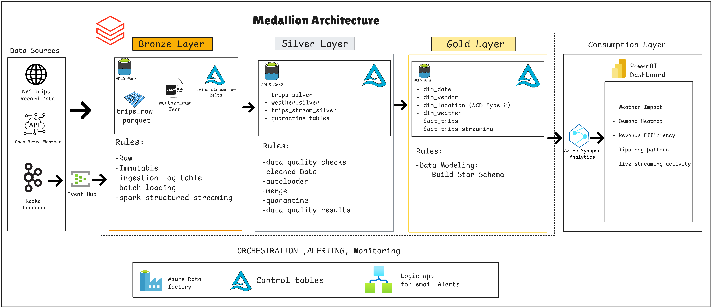
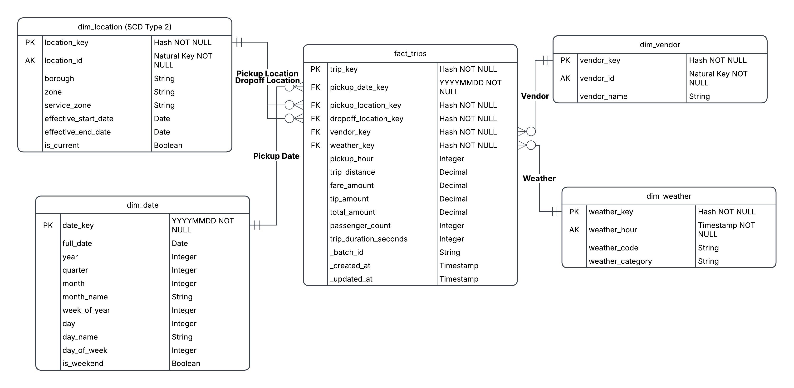

# NYC Taxi + Weather Cloud Data Pipeline

An end-to-end, production-style data engineering pipeline built on Microsoft Azure — ingesting NYC Yellow Taxi trip data and Open-Meteo weather data through three genuinely distinct ingestion patterns, transforming through a medallion architecture, and serving business-ready analytics via Synapse Serverless SQL and Power BI.

---

## Architecture



This pipeline ingests NYC Yellow Taxi trip records (batch + incremental) and Open-Meteo weather data via REST API, plus a simulated real-time trip-event stream, into Azure Data Lake Storage. Azure Databricks (PySpark + Delta Lake, with Auto Loader and MERGE) cleans, conforms, and models the data into a Bronze/Silver/Gold layout with a star schema and a slowly changing dimension. Azure Data Factory orchestrates the batch and incremental pipelines end-to-end with retries, dependencies, and centralized alerting; automated data-quality checks quarantine bad records with a full audit trail; and the Gold layer is served through Power BI, answering real business questions about how weather affects taxi demand and revenue.

---

## Tech stack

| Layer         | Technology                                                                |
| ------------- | ------------------------------------------------------------------------- |
| Storage       | Azure Data Lake Storage Gen2 (Bronze / Silver / Gold containers)          |
| Orchestration | Azure Data Factory                                                        |
| Processing    | Azure Databricks (PySpark, Delta Lake, Structured Streaming, Auto Loader) |
| Streaming     | Azure Event Hubs (Kafka-compatible endpoint), `kafka-python`              |
| Consumption   | Azure Synapse Serverless SQL, Power BI                                    |
| Secrets       | Azure Key Vault (Databricks-backed secret scope)                          |
| Alerting      | Azure Logic Apps                                                          |

---

## Repository structure

```
/notebooks
  /bronze
    stream_consume_trips.py      # Structured Streaming consumer (Continuous Job)
  /silver
    clean_trips.py               # Auto Loader + MERGE, additive schema evolution
    clean_weather.py             # Auto Loader + MERGE, schemaHints
    clean_stream_trips.py        # Chained streaming Silver (Continuous Job)
  /gold
    build_dim_date.py
    build_dim_location_scd2.py   # SCD Type 2
    build_dim_vendor.py          # SCD Type 1
    build_dim_weather.py
    build_fact_trips.py
    build_fact_trips_streaming.py
  /utils
    adls_auth.py                    # OAuth (service principal) config for ADLS Gen2
    control_table.py                # ingestion_log + watermark_log helpers
    dq_helpers.py                   # shared data-quality check framework
    log_adf_batch_summary.py
    update_weather_watermark_and_log.py
    log_pipeline_run.py
/adf                                # exported ADF pipeline/trigger definitions
/synapse                                # Synapse view DDL
/scripts
  trip_event_producer.py            # local Kafka producer, simulated live trips
/docs
  arch-diagram.png
  er-diagram.png

README.md
```

---

## Data sources

| Source                                                                                           | Type               |
| ------------------------------------------------------------------------------------------------ | ------------------ |
| [NYC TLC Yellow Taxi Trip Records](https://www.nyc.gov/site/tlc/about/tlc-trip-record-data.page) | HTTP / Parquet     |
| [Open-Meteo Historical Weather API](https://open-meteo.com/)                                     | HTTP / JSON        |
| Simulated live trip events                                                                       | Kafka (Event Hubs) |

---

## Medallion architecture

- **Bronze** — raw, as-landed data. Partitioned by date. No transformations.
- **Silver** — cleaned, deduplicated, schema-conformed. Built with Databricks Auto Loader (incremental, schema-evolution-aware) for trips/weather, and genuinely chained Structured Streaming for the simulated stream. Writes via Delta `MERGE`, not full overwrite. Row-level data quality checks quarantine failing records with a documented reason; passing-but-flagged rows are retained with a warning.
- **Gold** — business-ready star schema: `fact_trips`, `fact_trips_streaming` (kept as a separate mart — see design doc), `dim_date`, `dim_location` (**SCD Type 2**), `dim_vendor` (SCD Type 1), `dim_weather`. Surrogate keys are deterministic SHA-256 hashes of natural keys, not auto-increment.



---

## Data quality

Automated checks cover nulls, duplicates, range/bounds violations, referential integrity, and schema drift, logged to a dedicated `dq_results` Delta table with severity, check name, rows checked/failed, and the action taken.

**Real findings from this project** :

| Finding                                          | Rate       | Explanation                                                                                                             |
| ------------------------------------------------ | ---------- | ----------------------------------------------------------------------------------------------------------------------- |
| Negative fares                                   | 5.85%      | Concentrated in payment_type=0 and Vendor 2 — consistent with an adjustment/refund recording convention, not corruption |
| December rate drop                               | 12% → 1.4% | Confirmed via normalized trip volume (not raw count) as a genuine practice change, not a data completeness issue        |
| Impossible trip sequences (pickup after dropoff) | 1.12%      | Genuine data errors, quarantined                                                                                        |
| Duplicate trip keys                              | 1.6%       | Small group sizes (max 4), consistent with coincidental natural-key collisions, not a key-design flaw                   |

**Schema drift handling:** additive changes (e.g., TLC's `Airport_fee`/`cbd_congestion_fee` columns introduced mid-year) are automatically detected and evolved via Auto Loader. Breaking changes (type changes, disappeared columns) are deliberately **not** auto-handled — they throw a real exception, are logged as a distinct critical event, and halt the pipeline without advancing any state, requiring human review. Column renames are a known, documented limitation (see design doc).

---

## Orchestration

`pl_master_orchestrator` (Azure Data Factory), triggered monthly by a single Tumbling Window trigger (`tr_master_monthly_run`):

```
pipeline_start (log STARTED)
  → Check_Zone_Lookup (ingest reference data if missing)
  → [Ingest_Trips ‖ Ingest_Weather]  (parallel)
  → Silver_Processing (Auto Loader + MERGE, parallel per source)
  → Gold_Build (dbutils.notebook.run, isolated execution context)
  → pipeline_end (log SUCCEEDED)
```

Every stage has its own failure path (Web Activity → Logic App → email alert), so a failure email identifies exactly which phase failed without needing to open ADF Monitor. Streaming ingestion and streaming Silver are **not** part of this pipeline — they run as independent Databricks Continuous Jobs, since ADF's activity model doesn't fit a perpetual query.

---

## Monitoring & control tables

Four purpose-built Delta control tables, each with a single responsibility:

| Table              | Purpose                                                           |
| ------------------ | ----------------------------------------------------------------- |
| `ingestion_log`    | Per-partition ingestion audit trail (append-only)                 |
| `watermark_log`    | Current-state cursor for weather's incremental load (upserted)    |
| `dq_results`       | Per-check data quality outcomes (append-only)                     |
| `pipeline_run_log` | Whole-pipeline-run lifecycle status: STARTED / SUCCEEDED / FAILED |

---

## Consumption layer

Azure Synapse Serverless SQL exposes Gold via Delta-aware views (`OPENROWSET ... FORMAT = 'DELTA'`). Power BI connects via a **composite model**: batch views (weather impact, demand heatmap, tipping patterns, revenue efficiency) are Import mode; the streaming activity view is DirectQuery, so it reflects genuinely live data rather than a stale snapshot.

**Business questions answered:**

1. How does weather affect trip volume and revenue?
2. When and where is demand highest (day/hour/borough)?
3. How do tipping patterns vary by weather and location?
4. Which boroughs generate the most revenue per mile/minute?

---

---

## Setup & running

for full setup instructions, how to run the pipeline end-to-end, and how to recover from common failure scenarios.

**Prerequisites:** Azure subscription, Azure CLI, an Azure Databricks workspace, ADF, Event Hubs, Synapse, and Power BI Desktop.
